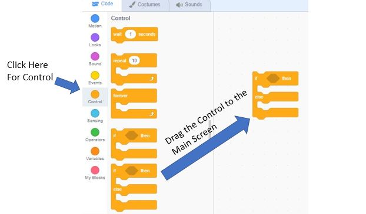
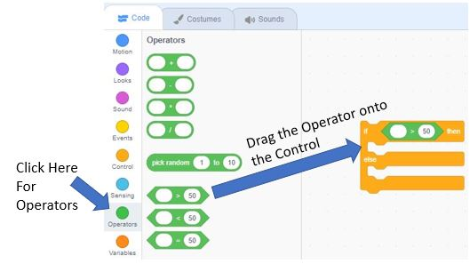
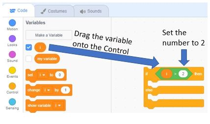
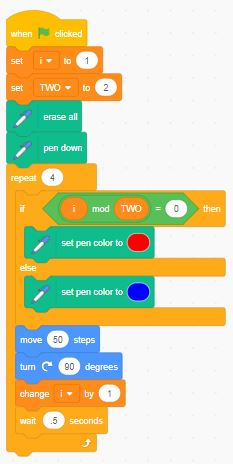
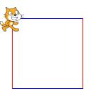

## Conditionals

In this example program we will make the sprite draw
different sides of the square using different colors.

There are two things we do with variables in Scratch.  The first is to use set block to **assign values** to the variable we defined to the values in circle.  The second thing we do is to **compare** values to the left and right of an operator.  The result of a comparison is always TRUE or FALSE.

Here is the basic syntax of the Scratch conditional operator:

The conditional operators in scratch reside in the Control navigation section.  We will select the if-then-else block for this example.

Next, we will pick an operator from the Operators navigation on the left side and move it into our control

Next, let's create a variable, i.  We will not assign it a value for this example.  As a reminder, you can return to the lesson on creating [variables](./04-variables-square.md)

Finally, let's insert our variable into the operator, and change the test to check if the value of our variable is greater than 2.

Now that we have built the conditional. let's discuss what the conditional is doing.  The top part of the conditional checks to see it the **value** of our variable **i** is greater than **2**.  If it is, then we will do the action or set of actions contained in the first section.  Otherwise we will do the action or set of actions when the **value** or our variable **i** is less than or equal to **2**. 

## Changing Odd and Even Edge Colors
We would like every other side of a square to change color.  To do this we will add an if-then-else block of code to our example program.  This block of code is called a conditional block.  The condition is an expression that evaluates to be either TRUE for FALSE.  In our example we will test to see if the index of our loop (the letter "i") is ODD or EVEN.  We can do this by looking at the remainder after we divide by 2. Note: We will define a variable called **TWO** to store the constant value of the number 2. Scratch has a handy operator called the modulo operator that uses the mod block as an operator.  The test for ODD or EVEN is this:

In our previous loop lesson, we created a loop.  We will add the variables **i** (initally set to 1), and **TWO** (set to 2).  As we execute our loop, we will test the value of **i**, set the pen color to red or blue, based in the result, then move the sprite, and increase the value of **i**.  For 1 and 3, the first and third edges the result of divide by 2 will return 1 which is the same as TRUE.  For 2 and 4 (the vertical sides of the square), the expression will evaluate to 0 since the remainder of 2/2 and 4/2 is zero. 

 

[Conditional Square Example](https://scratch.mit.edu/projects/768082575/)

## Experiment
1. Can you make the sprite use a larger pen size?  Try **set pen size to 10** for the red and **set pen size to 3** for the blue.
1. What happens if you make a 9 sided figure and want to use a third color?  
   Hint 1: Remember that the angle measurement is 360 / 9 or 40
   Hint 2: You can add another if-then-else block inside the else section

