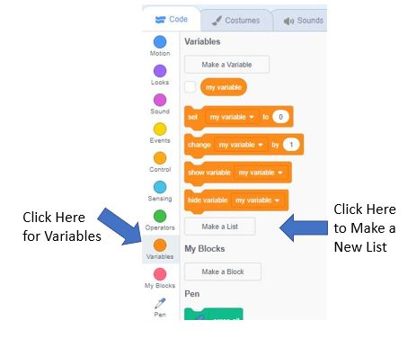
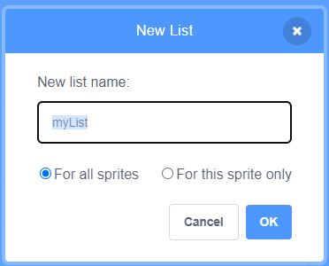
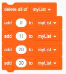
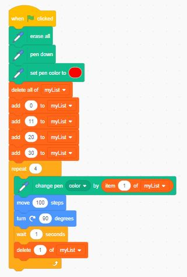

# Draw A Square With Different Color Sides
We can use a variable called a list to hold our color offsets, then set the pen color using an offset from the list.

First, we need to a list as a variable

Just like any other variable, we'll give our list a name

Once we have our list, we want to make sure it starts out empty each time we start our program.  Then we can add our color offsets to the list.

Finally, we set the initial pen color to red, then start our loop.  We'll use the first item in the list during each pass through the loop to offset the color of the pen before drawing the side of the square.  We can remove the first item in the list after moving the sprite so we have a new first item in the list for the next pass through the loop.

[Draw the Multi-Color Square](https://scratch.mit.edu/projects/768097374/)

